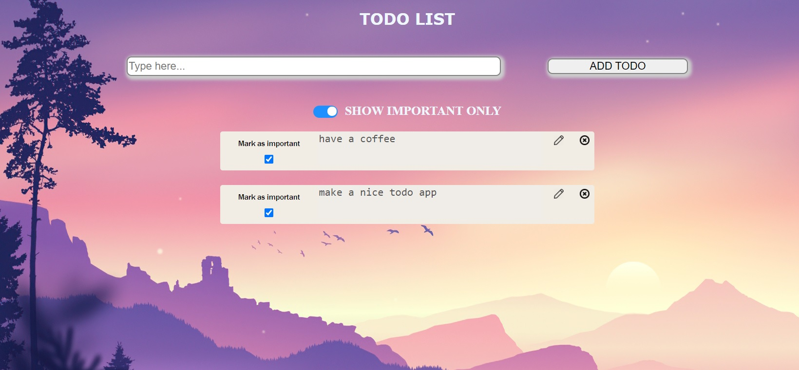

<p align="center">
  
  <h1 align="center">TODO LIST</h1>

  <p align="center">
    <i>
    A React-based todo list. 
    Besides adding and deleting items a user is also able to make and save edits for any of the todo items, mark any item as important and sort all todos depending on their importance. The app is fully responsive.
    </i>
    <br />
    <br />
    
</p>
</br>

# Table of Contents

- [:floppy_disk: Installation](#floppy_disk-installation)
- [:microscope: About the code](#microscope-about-the-code)

</br>

# :floppy_disk: Installation

1. Clone the repo:
   ```sh
   git clone https://github.com/yuryiva/todo-list-simple.git
   ```
2. Install NPM packages:
   ```sh
   npm install
   ```
3. Run the app in the development mode with `npm start`

# :microscope: About the code

The main technologies and tools used to build the Carousel are the following:

- React 
- React Hooks
- SCSS